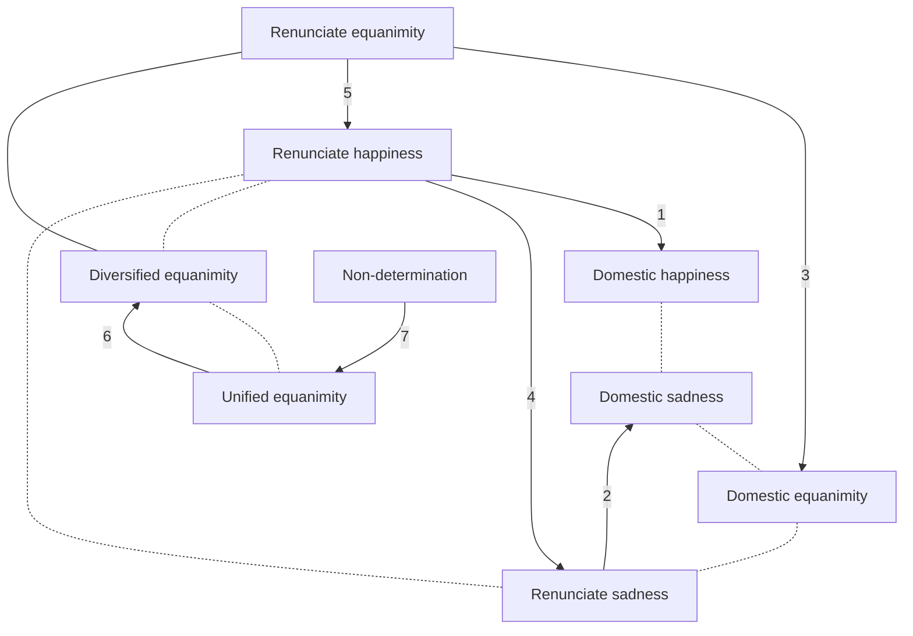

"Relying on this, give up that."

From [MN 137](https://suttacentral.net/mn137/en/sujato)

```mermaid

graph TD

rh[Renunciate happiness]

rs[Renunciate sadness]

re[Renunciate equanimity]

dh[Domestic happiness]

ds[Domestic sadness]

de[Domestic equanimity]

dive[Diversified equanimity]

ue[Unified equanimity]

nd[Non-determination]

  

rh -- 1 --> dh

rs -- 2 --> ds

re -- 3 --> de

rh -- 4 --> rs

re -- 5 --> rh

re --- dive

ue -- 6 --> dive

nd -- 7 --> ue

dh -.- ds -.- de -.- rs -.- rh -.- dive -.- ue

```
